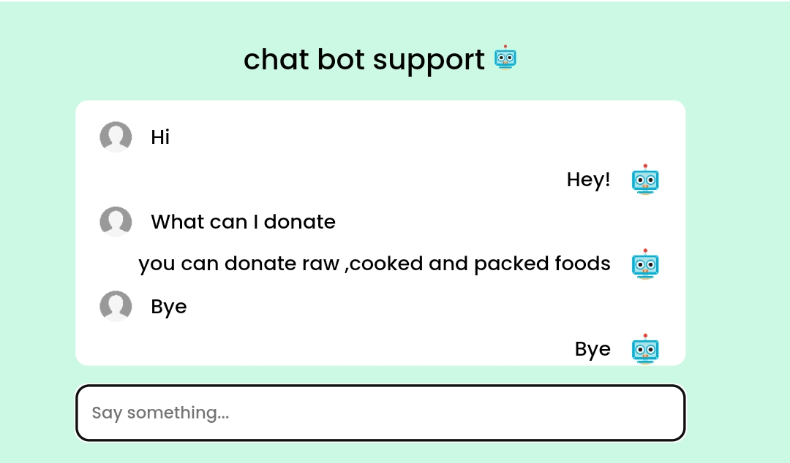
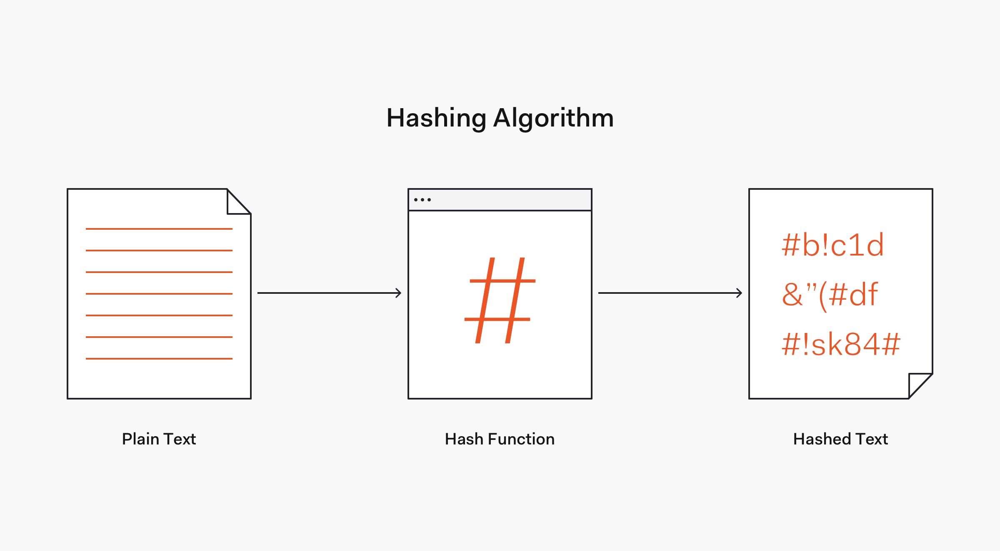

# ExpirySaver
<!--  -->
<h2>Tools and Technologies</h2> 
<ul>
 <li>Frontend : HTML, CSS,  JavaScript</li>
 <li>Backend  : PHP/li>
 <li>webserver: XAMPP SERVER</li>
 <li>Database: MySQL </li>
</ul>

 <h2>The system has three modules. </h2>
    <ul><li>User</li>
    <li>Admin</li>
    <li>Delivery</li></ul>
    
    <h3>User </h3>
    <h3>Admin </h3>
     <h3>Delivery </h3>
    <h3>features:</h3>
    <ul><li>Mobile Screen friendly website.</li>
      <li>chatbot support</li>
      <li>Secure Login</li>
      </ul>
      <h2>Mobile Screen friendly website.</h2>
      
      <h2>chatbot support</h2>
      
      <h2>Secure Login</h2>
      
      <h2>How to run</h2>
      <ol>
       <li>Download the project zip file</li>
       <li> Extract the file and copy the folder</li>
       <li>Paste inside root directory(for xampp xampp/htdocs, for wamp wamp/www, for lamp var/www/Html)</li>
       <li> Open PHPMyAdmin (http://localhost/phpmyadmin)</li>
       <li> Create a database</li>
       <li>Import demo.sql file(inside database folder)</li>
       <li> Run the script http://localhost/folderName </li> </ol>
